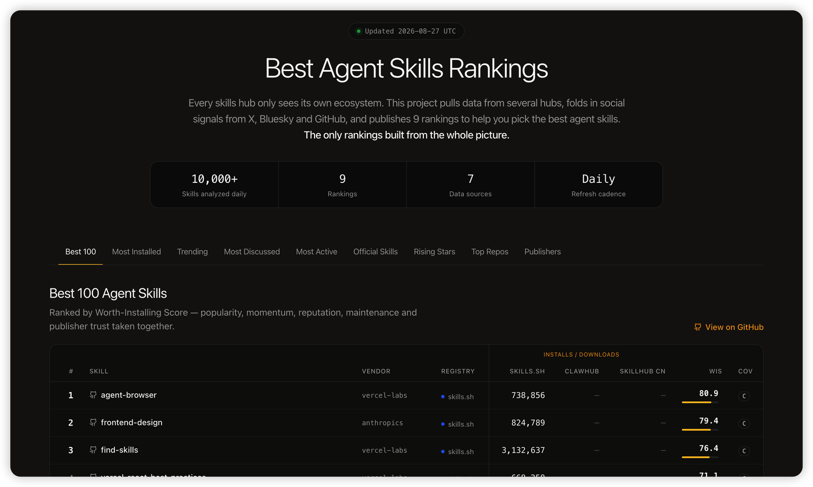

<div align="center">

# 🏆 Best Agent Skills

**매일 업데이트되는 Agent Skills Top 100 순위 — skills.sh, ClawHub, Tencent SkillHub, GitHub, X 등의 설치 수, 성장세, 소셜 화제성을 집계합니다. 오픈 데이터(CSV).**

[](../data/latest)
[](#순위)
[](#순위)
[](../data/latest)
[](../LICENSE)
[](https://github.com/LinklyAI/best-skills)
[](https://x.com/BlueeonY)

[English](../README.md) | [简体中文](README.zh-CN.md) | [日本語](README.ja.md) | [한국어](README.ko.md) | [Español](README.es.md) | [Deutsch](README.de.md) | [Русский](README.ru.md)

매일 갱신되는 순위 — ⭐ **Star**로 소식을 받고, X의 [**@BlueeonY**](https://x.com/BlueeonY)가 매일의 변동을 전합니다.

</div>

<p align="center">
  <a href="https://linkly.ai/skills">
    
  </a>
  <br>
  <a href="https://linkly.ai/skills">실시간 인터랙티브 순위 살펴보기 →</a>
</p>

## 이 프로젝트를 만든 이유

각 Skills 레지스트리는 자신의 생태계만 볼 수 있습니다. skills.sh는 Claude/Vercel CLI 설치 수를, ClawHub는 OpenClaw 다운로드 수를, Tencent SkillHub는 중국 내 설치 수를 집계하지만 어느 곳도 소셜 화제성은 보여 주지 않습니다. **Best Skills는 이 모든 관점을 하나의 생태계 통합 화면으로 합칩니다**. 각 Skill의 전 세계 설치 수, 중국 설치 수, 소셜 언급 수를 나란히 확인할 수 있습니다. 이와 같은 순위는 다른 곳에 없습니다.

- 매일 갱신되는 **9개 순위**
- **원본 수치 보존** — 모든 CSV에 플랫폼별 원본 집계를 유지해 누구나 검증하거나 다시 순위를 매길 수 있습니다
- **비교할 수 없는 수치를 합산하지 않음** — 플랫폼 간 수치는 나란히 표시하고, 플랫폼 내부 백분위 종합 점수로 순위를 매깁니다([방법론](methodology.md) 참조)

## 순위

<!-- RANKINGS:START -->

> 마지막 업데이트: **2026-09-05** (UTC) · 각 목록의 Top 10 미리 보기 — 전체 Top 100은 CSV에서 확인하세요.

<details open>
<summary><b>🏆 Best 100 (설치 가치 점수)</b></summary>

| # | Skill | 공급자 | WIS | 커버리지 |
| --- | --- | --- | --- | --- |
| 1 | [agent-browser](https://www.skills.sh/vercel-labs/agent-browser/agent-browser) | [vercel-labs](https://www.skills.sh/vercel-labs) | 76.6 | C |
| 2 | [find-skills](https://www.skills.sh/vercel-labs/skills/find-skills) | [vercel-labs](https://www.skills.sh/vercel-labs) | 76.2 | C |
| 3 | [frontend-design](https://www.skills.sh/anthropics/skills/frontend-design) | [anthropics](https://www.skills.sh/anthropics) | 75.8 | C |
| 4 | [vercel-react-best-practices](https://www.skills.sh/vercel-labs/agent-skills/vercel-react-best-practices) | [vercel-labs](https://www.skills.sh/vercel-labs) | 67.9 | C |
| 5 | [grill-me](https://www.skills.sh/mattpocock/skills/grill-me) | [mattpocock](https://www.skills.sh/mattpocock) | 67.5 | C |
| 6 | [microsoft-foundry](https://www.skills.sh/microsoft/azure-skills/microsoft-foundry) | [microsoft](https://www.skills.sh/microsoft) | 67.4 | C |
| 7 | [skill-creator](https://www.skills.sh/anthropics/skills/skill-creator) | [anthropics](https://www.skills.sh/anthropics) | 66.8 | C |
| 8 | [web-design-guidelines](https://www.skills.sh/vercel-labs/agent-skills/web-design-guidelines) | [vercel-labs](https://www.skills.sh/vercel-labs) | 66.6 | C |
| 9 | [grill-with-docs](https://www.skills.sh/mattpocock/skills/grill-with-docs) | [mattpocock](https://www.skills.sh/mattpocock) | 65 | C |
| 10 | [ai-image-generation](https://www.skills.sh/skills-101/superpowers/ai-image-generation) | [skills-101](https://www.skills.sh/skills-101) | 64.7 | C |

➡️ 전체 목록: [best-100.csv](../data/2026-09-05/rankings/best-100.csv)

</details>

<details>
<summary><b>📈 설치 수 상위 (모든 생태계)</b></summary>

| # | Skill | skills.sh | ClawHub | SkillHub 중국 |
| --- | --- | --- | --- | --- |
| 1 | [find-skills](https://www.skills.sh/vercel-labs/skills/find-skills) | 3,261,538 | — | — |
| 2 | [self-improving-agent](https://clawhub.ai/pskoett/skills/self-improving-agent) | — | 477,772 | 1,167,672 |
| 3 | [grill-me](https://www.skills.sh/mattpocock/skills/grill-me) | 1,062,604 | — | — |
| 4 | find-skills | — | — | 901,839 |
| 5 | [grill-with-docs](https://www.skills.sh/mattpocock/skills/grill-with-docs) | 906,156 | — | — |
| 6 | tencent-docs | — | — | 773,467 |
| 7 | [improve-codebase-architecture](https://www.skills.sh/mattpocock/skills/improve-codebase-architecture) | 869,146 | — | — |
| 8 | [frontend-design](https://www.skills.sh/anthropics/skills/frontend-design) | 855,197 | — | — |
| 9 | agent-browser | — | — | 729,731 |
| 10 | [self-improving](https://clawhub.ai/ivangdavila/skills/self-improving) | — | 208,632 | 394,521 |

➡️ 전체 목록: [top-installs.csv](../data/2026-09-05/rankings/top-installs.csv)

</details>

<details>
<summary><b>🚀 트렌드 (7일)</b></summary>

| # | Skill | 설치 수 | 주간 Δ% |
| --- | --- | --- | --- |
| 1 | [design-mobile-apps](https://www.skills.sh/designed-by-ai/skills/design-mobile-apps) | 19,350 | — |
| 2 | [anti-ui-slop](https://www.skills.sh/uizze.com/anti-ui-slop) | 674,085 | 3 |
| 3 | [ai-video-generation](https://www.skills.sh/skills-101/superpowers/ai-video-generation) | 579,276 | 0.7 |
| 4 | [ai-image-generation](https://www.skills.sh/skills-101/superpowers/ai-image-generation) | 578,584 | 0.7 |
| 5 | [twitter-automation](https://www.skills.sh/skills-101/superpowers/twitter-automation) | 578,332 | 0.6 |
| 6 | [ai-avatar-video](https://www.skills.sh/skills-101/superpowers/ai-avatar-video) | 578,447 | 0.6 |
| 7 | [reddit-automation](https://www.skills.sh/flowkit-labs/skills/reddit-automation) | 303,356 | 39.4 |
| 8 | [video-edit](https://www.skills.sh/genmedia-labs/skills/video-edit) | 335,514 | 10.3 |
| 9 | [ai-music](https://www.skills.sh/genmedia-labs/skills/ai-music) | 335,185 | 10.4 |
| 10 | [ai-video-generation](https://www.skills.sh/genmedia-labs/skills/ai-video-generation) | 335,309 | 10.2 |

➡️ 전체 목록: [trending-7d.csv](../data/2026-09-05/rankings/trending-7d.csv)

</details>

<details>
<summary><b>💬 소셜 화제성 (X · HN · Bluesky · GitHub, 7일)</b></summary>

| # | Skill | X | HN | Bluesky | GitHub |
| --- | --- | --- | --- | --- | --- |
| 1 | [self-improving](https://clawhub.ai/ivangdavila/skills/self-improving) | 100+ | 5 | 64 | 3 |
| 2 | [self-improving-agent](https://clawhub.ai/pskoett/skills/self-improving-agent) | 33 | 1 | 4 | 1 |
| 3 | [agent-browser](https://www.skills.sh/vercel-labs/agent-browser/agent-browser) | 100+ | 0 | 4 | 26 |
| 4 | [grill-me](https://www.skills.sh/mattpocock/skills/grill-me) | 100+ | 0 | 5 | 24 |
| 5 | [frontend-design](https://www.skills.sh/anthropics/skills/frontend-design) | 72 | 0 | 6 | 61 |
| 6 | [skill-creator](https://www.skills.sh/anthropics/skills/skill-creator) | 83 | 0 | 1 | 136 |
| 7 | [find-skills](https://www.skills.sh/vercel-labs/skills/find-skills) | 21 | 0 | 2 | 147 |
| 8 | [nano-banana-pro](https://clawhub.ai/steipete/skills/nano-banana-pro) | 40 | 0 | 8 | 3 |
| 9 | [browser-use](https://www.skills.sh/browser-use/browser-use/browser-use) | — | 1 | 18 | 7 |
| 10 | [domain-modeling](https://www.skills.sh/mattpocock/skills/domain-modeling) | — | 1 | 6 | 10 |

➡️ 전체 목록: [social-buzz.csv](../data/2026-09-05/rankings/social-buzz.csv)

</details>

<details>
<summary><b>🔧 가장 활발함 (인기 있고 자주 업데이트됨)</b></summary>

| # | Skill | 업데이트 | 버전 수 |
| --- | --- | --- | --- |
| 1 | [api-gateway](https://clawhub.ai/byungkyu/skills/api-gateway) | 2026-09-05 | 157 |
| 2 | [chinese-official-writing](https://clawhub.ai/gongyu0918-debug/skills/chinese-official-writing) | 2026-09-04 | 110 |
| 3 | [google-drive](https://clawhub.ai/byungkyu/skills/google-drive) | 2026-09-04 | 17 |
| 4 | [stripe-api](https://clawhub.ai/byungkyu/skills/stripe-api) | 2026-09-04 | 16 |
| 5 | [linear-api](https://clawhub.ai/byungkyu/skills/linear-api) | 2026-09-04 | 16 |
| 6 | [getnote](https://clawhub.ai/iswalle/skills/getnote) | 2026-09-02 | 46 |
| 7 | [google-analytics](https://clawhub.ai/byungkyu/skills/google-analytics) | 2026-09-04 | 15 |
| 8 | [linkedin-api](https://clawhub.ai/byungkyu/skills/linkedin-api) | 2026-09-04 | 14 |
| 9 | [salesforce-api](https://clawhub.ai/byungkyu/skills/salesforce-api) | 2026-09-04 | 13 |
| 10 | [planning-with-files](https://clawhub.ai/othmanadi/skills/planning-with-files) | 2026-09-02 | 20 |

➡️ 전체 목록: [most-active.csv](../data/2026-09-05/rankings/most-active.csv)

</details>

<details>
<summary><b>✅ Official 100 (검증된 게시자)</b></summary>

| # | Skill | 공급자 | 검증 플랫폼 |
| --- | --- | --- | --- |
| 1 | [find-skills](https://www.skills.sh/vercel-labs/skills/find-skills) | [vercel-labs](https://www.skills.sh/vercel-labs) | skills.sh |
| 2 | tencent-docs | 腾讯科技（深圳）有限公司 | skillhub |
| 3 | [frontend-design](https://www.skills.sh/anthropics/skills/frontend-design) | [anthropics](https://www.skills.sh/anthropics) | skills.sh |
| 4 | [agent-browser](https://www.skills.sh/vercel-labs/agent-browser/agent-browser) | [vercel-labs](https://www.skills.sh/vercel-labs) | skills.sh |
| 5 | [github](https://clawhub.ai/steipete/skills/github) | [steipete](https://clawhub.ai/steipete) | clawhub |
| 6 | multi-search-engine | 成都智创未来教育管理合伙企业（有限合伙） | skillhub |
| 7 | [vercel-react-best-practices](https://www.skills.sh/vercel-labs/agent-skills/vercel-react-best-practices) | [vercel-labs](https://www.skills.sh/vercel-labs) | skills.sh |
| 8 | ima-skills | 腾讯科技（深圳）有限公司 | skillhub |
| 9 | [weather](https://clawhub.ai/steipete/skills/weather) | [steipete](https://clawhub.ai/steipete) | clawhub |
| 10 | [gog](https://clawhub.ai/steipete/skills/gog) | [steipete](https://clawhub.ai/steipete) | clawhub |

➡️ 전체 목록: [official-100.csv](../data/2026-09-05/rankings/official-100.csv)

</details>

<details>
<summary><b>🏢 공식 공급자 (플랫폼별 그룹)</b></summary>

| # | 플랫폼 | 공급자 | Skills 수 | 설치/다운로드 수 |
| --- | --- | --- | --- | --- |
| 1 | [skills.sh](https://www.skills.sh) | [microsoft](https://www.skills.sh/microsoft) | 582 | 7,098,914 |
| 2 | [skills.sh](https://www.skills.sh) | [vercel-labs](https://www.skills.sh/vercel-labs) | 252 | 3,192,306 |
| 3 | [skills.sh](https://www.skills.sh) | [github](https://www.skills.sh/github) | 406 | 2,002,106 |
| 4 | [skills.sh](https://www.skills.sh) | [anthropics](https://www.skills.sh/anthropics) | 605 | 1,942,411 |
| 5 | [skills.sh](https://www.skills.sh) | [firebase](https://www.skills.sh/firebase) | 55 | 685,617 |
| 6 | [skills.sh](https://www.skills.sh) | [firecrawl](https://www.skills.sh/firecrawl) | 286 | 482,310 |
| 7 | [skills.sh](https://www.skills.sh) | [remotion-dev](https://www.skills.sh/remotion-dev) | 19 | 305,359 |
| 8 | [skills.sh](https://www.skills.sh) | [flutter](https://www.skills.sh/flutter) | 88 | 286,211 |
| 9 | [skills.sh](https://www.skills.sh) | [expo](https://www.skills.sh/expo) | 18 | 283,306 |
| 10 | [skills.sh](https://www.skills.sh) | [google-labs-code](https://www.skills.sh/google-labs-code) | 30 | 260,911 |

➡️ 전체 목록: [official-vendors.csv](../data/2026-09-05/rankings/official-vendors.csv)

</details>

<details>
<summary><b>⭐ 상위 저장소</b></summary>

| # | 저장소 | Stars | 최근 푸시 |
| --- | --- | --- | --- |
| 1 | [obra/superpowers](https://github.com/obra/superpowers) | 281,849 | 2026-09-04 |
| 2 | [mattpocock/skills](https://github.com/mattpocock/skills) | 250,769 | 2026-09-04 |
| 3 | [anthropics/skills](https://github.com/anthropics/skills) | 174,216 | 2026-09-03 |
| 4 | [anthropics/claude-code](https://github.com/anthropics/claude-code) | 144,110 | 2026-09-04 |
| 5 | [vercel/next.js](https://github.com/vercel/next.js) | 142,095 | 2026-09-05 |
| 6 | [DietrichGebert/ponytail](https://github.com/DietrichGebert/ponytail) | 126,508 | 2026-09-04 |
| 7 | [nextlevelbuilder/ui-ux-pro-max-skill](https://github.com/nextlevelbuilder/ui-ux-pro-max-skill) | 125,074 | 2026-09-03 |
| 8 | [shadcn-ui/ui](https://github.com/shadcn-ui/ui) | 123,059 | 2026-09-04 |
| 9 | [browser-use/browser-use](https://github.com/browser-use/browser-use) | 112,317 | 2026-09-05 |
| 10 | [JuliusBrussee/caveman](https://github.com/JuliusBrussee/caveman) | 103,643 | 2026-09-04 |

➡️ 전체 목록: [top-repos.csv](../data/2026-09-05/rankings/top-repos.csv)

</details>

<details>
<summary><b>🌱 떠오르는 신예 (등록 후 30일 미만)</b></summary>

| # | Skill | 경과 일수 | 인기도 |
| --- | --- | --- | --- |
| 1 | multi-search-engine | 17 | 0.991 |
| 2 | anti-fraud | 19 | 0.984 |
| 3 | beatra | 20 | 0.979 |
| 4 | tencent-meeting-mcp | 1 | 0.973 |
| 5 | talking-avatar-video | 3 | 0.935 |
| 6 | ecommerce-listing-image-set | 16 | 0.934 |
| 7 | hot-topic-content-maker | 16 | 0.933 |
| 8 | live-commerce-script-studio | 20 | 0.932 |
| 9 | ai-podcast-voiceover | 3 | 0.929 |
| 10 | obsidian | 12 | 0.91 |

➡️ 전체 목록: [rising-stars.csv](../data/2026-09-05/rankings/rising-stars.csv)

</details>

<!-- RANKINGS:END -->

### 각 목록의 의미

| 목록 | 순위 기준 |
| --- | --- |
| `best-100` | 종합 설치 가치 점수(인기도 + 상승세 + 화제성 + 유지관리 + 신뢰도) |
| `top-installs` | 모든 생태계를 합친 설치 수 상위 |
| `trending-7d` | 지난 7일 동안 가장 빠르게 성장 |
| `social-buzz` | X, Hacker News, Bluesky, GitHub에서 가장 많이 언급됨(언급 출처를 특정할 수 없는 일반 이름의 Skills 제외) |
| `most-active` | 인기 Skills 중 가장 자주 업데이트됨 |
| `official-100` | 검증된 게시자의 인기 Skills |
| `official-vendors` | 총 설치 수 기준 검증된 공급자 순위 |
| `top-repos` | Skills가 속한 GitHub 저장소를 Stars 수로 정렬 |
| `rising-stars` | 처음 확인된 지 30일 미만인 우수 신규 Skills |

## 데이터

```text
data/
├── YYYY-MM-DD/
│   ├── raw/                # 플랫폼별 원본 집계, 수정 없음
│   │   ├── skills-sh.csv · clawhub.csv · skillhub.csv · github-repos.csv
│   │   └── buzz.csv · x-posts.csv · …
│   └── rankings/           # raw/에서 계산한 9개 순위 목록
│       ├── best-100.csv · top-installs.csv · trending-7d.csv
│       └── social-buzz.csv · … · rising-stars.csv
├── latest/                 # 항상 가장 최근 날짜의 복사본
└── index/
    └── first-seen.csv      # 최초 확인 날짜 누적 기록(떠오르는 신예에 사용)
```

날짜별로 하나의 폴더가 있으며 CSV만 포함합니다. 종합 점수에는 산출 근거가 된 플랫폼별 원본 수치가 항상 함께 제공됩니다. 오늘의 목록만 보려면 `data/latest/`에서 시작하세요.

데이터 출처, 정규화 규칙, 알려진 제한 사항은 [docs/methodology.md](methodology.md)를 참조하세요.

## 데이터 출처 및 저작자 표시

설치/다운로드 수는 [skills.sh](https://www.skills.sh), [ClawHub](https://clawhub.ai)(제3자 디렉터리 정책을 따르며 Skill 페이지는 정식 ClawHub 등록 페이지로 연결), [Tencent SkillHub](https://skillhub.cn), [GitHub API](https://docs.github.com)의 공개 엔드포인트에서 수집합니다. 소셜 신호는 X, [Hacker News (Algolia)](https://hn.algolia.com), [Bluesky](https://bsky.app), GitHub 검색에서 가져옵니다. 이 프로젝트는 해당 플랫폼의 승인이나 제휴를 받지 않았습니다. 집계는 각 플랫폼의 자체 방식을 따르며 플랫폼 간 수치를 합산하지 않습니다.

## 라이선스

데이터와 문서는 [CC BY 4.0](../LICENSE)으로 공개되며, 상업적 이용을 포함해 자유롭게 사용·재배포·활용할 수 있습니다.

### 출처 표시 방법

데이터가 실리는 곳에 다음 한 줄을 넣어 주세요:

> Data from [Best Skills](https://github.com/LinklyAI/best-skills) by [@BlueeonY](https://x.com/BlueeonY) — [CC BY 4.0](https://creativecommons.org/licenses/by/4.0/)

이 저장소로 향하는 링크와 위에 나열된 플랫폼별 출처 표시를 유지해 주세요. 요구 사항은 이것이 전부이며, 별도의 허가는 필요하지 않습니다.

무언가 만드셨다면 [@BlueeonY](https://x.com/BlueeonY)가 꼭 보고 싶습니다. 라이선스상의 의무는 아니지만 알려 주시면 반갑겠습니다.

---

[@BlueeonY](https://x.com/BlueeonY)가 [Linkly AI](https://linkly.ai)에서 만들고 관리합니다 — Agent Skills를 지원하는 AI 로컬 지식 베이스.

도움이 되셨다면 ⭐ 하나가 더 많은 사람에게 닿는 데 도움이 됩니다.
