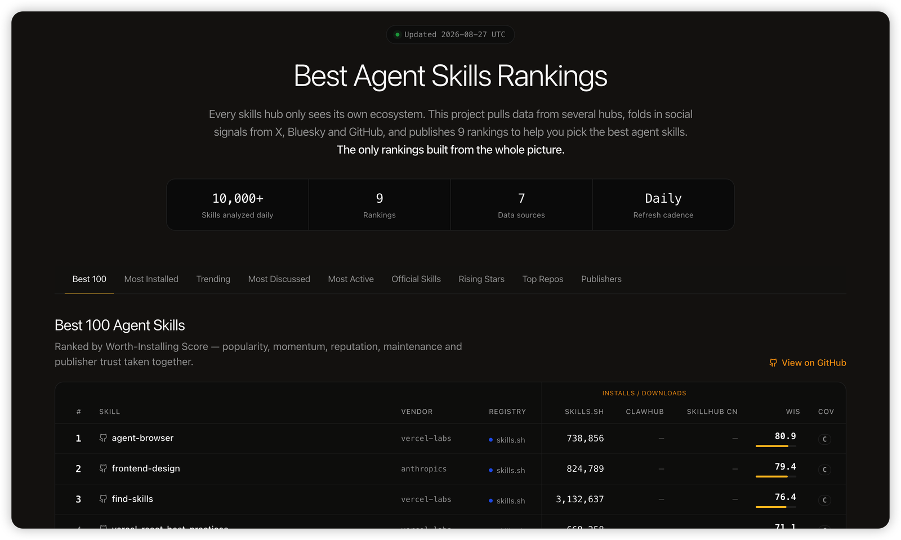

<div align="center">

# 🏆 Best Agent Skills

**每日更新的 Agent Skills Top 100 排行榜——聚合来自 skills.sh、ClawHub、腾讯 SkillHub、GitHub、X 等平台的安装量、增长趋势和社交热度。开放数据（CSV）。**

[](../data/latest)
[](#排行榜)
[](#排行榜)
[](../data/latest)
[](../LICENSE)
[](https://github.com/LinklyAI/best-skills)
[](https://x.com/BlueeonY)

[English](../README.md) | [简体中文](README.zh-CN.md) | [日本語](README.ja.md) | [한국어](README.ko.md) | [Español](README.es.md) | [Deutsch](README.de.md) | [Русский](README.ru.md)

排行榜每天更新——⭐ **Star** 追更新，或在 X 关注 [**@BlueeonY**](https://x.com/BlueeonY) 看每日异动。

</div>

<p align="center">
  <a href="https://linkly.ai/skills">
    
  </a>
  <br>
  <a href="https://linkly.ai/skills">探索实时交互榜单 →</a>
</p>

## 为什么创建这个项目

每个 Skills 注册平台只能看到自己的生态。skills.sh 统计 Claude/Vercel CLI 安装量，ClawHub 统计 OpenClaw 下载量，腾讯 SkillHub 统计中国区安装量——而它们都无法反映社交热度。**Best Skills 将这些视角合并成一个跨生态全景**：你可以并排查看每个 Skill 的全球安装量、中国区安装量和社交提及量。没有其他排行榜能做到这一点。

- **9 个排行榜**，每日刷新
- **保留原始数据**——每份 CSV 都保存各平台的原始计数，任何人都可以验证或重新排名
- **绝不混加不可比数据**——跨平台数据并排展示，并按各平台内部的百分位综合得分排名（参见[方法论](methodology.md)）
- **由 [jev](https://openrouter.ai/typesafe/jev-1.13) 判定，而非关键词计数**——TypeSafe 的判别模型逐条判断社交帖子是否真在谈论该 Skill、条目是否为真实且仍在维护的 Skill、以及所属类别；占位、已弃用和有害的条目不进入排行榜，所有判定概率均公开（参见[方法论](methodology.md#judgements-jev)）

## 排行榜

<!-- RANKINGS:START -->

> 最后更新：**2026-10-08**（UTC）· 每个榜单预览 Top 10——完整 Top 100 见 CSV 文件。

<details open>
<summary><b>🏆 最佳 100（值得安装得分）</b></summary>

| # | Skill | 发布者 | WIS | 覆盖度 |
| --- | --- | --- | --- | --- |
| 1 | [agent-browser](https://www.skills.sh/vercel-labs/agent-browser/agent-browser) | [vercel-labs](https://www.skills.sh/vercel-labs) | 80.8 | C |
| 2 | [find-skills](https://www.skills.sh/vercel-labs/skills/find-skills) | [vercel-labs](https://www.skills.sh/vercel-labs) | 76.1 | C |
| 3 | [frontend-design](https://www.skills.sh/anthropics/skills/frontend-design) | [anthropics](https://www.skills.sh/anthropics) | 74.2 | C |
| 4 | [grill-me](https://www.skills.sh/mattpocock/skills/grill-me) | [mattpocock](https://www.skills.sh/mattpocock) | 71.4 | C |
| 5 | [self-improving-agent](https://clawhub.ai/pskoett/skills/self-improving-agent) | — | 68.2 | B |
| 6 | [nano-banana-pro](https://clawhub.ai/steipete/skills/nano-banana-pro) | [steipete](https://clawhub.ai/steipete) | 67 | B |
| 7 | [skill-creator](https://www.skills.sh/anthropics/skills/skill-creator) | [anthropics](https://www.skills.sh/anthropics) | 66.4 | C |
| 8 | [web-design-guidelines](https://www.skills.sh/vercel-labs/agent-skills/web-design-guidelines) | [vercel-labs](https://www.skills.sh/vercel-labs) | 66.1 | C |
| 9 | [remotion-best-practices](https://www.skills.sh/remotion-dev/skills/remotion-best-practices) | [remotion-dev](https://www.skills.sh/remotion-dev) | 65.9 | C |
| 10 | [vercel-react-best-practices](https://www.skills.sh/vercel-labs/agent-skills/vercel-react-best-practices) | [vercel-labs](https://www.skills.sh/vercel-labs) | 64.1 | C |

➡️ 完整榜单：[best-100.csv](../data/2026-10-08/rankings/best-100.csv)

</details>

<details>
<summary><b>📈 安装量排行（所有生态）</b></summary>

| # | Skill | skills.sh | ClawHub | SkillHub 中国区 |
| --- | --- | --- | --- | --- |
| 1 | [find-skills](https://www.skills.sh/vercel-labs/skills/find-skills) | 3,739,069 | — | — |
| 2 | dev-expert | — | — | 2,639,694 |
| 3 | [grill-me](https://www.skills.sh/mattpocock/skills/grill-me) | 1,304,421 | — | — |
| 4 | parenting-expert | — | — | 2,025,399 |
| 5 | [self-improving-agent](https://clawhub.ai/pskoett/skills/self-improving-agent) | — | 483,141 | 1,337,135 |
| 6 | [grill-with-docs](https://www.skills.sh/mattpocock/skills/grill-with-docs) | 1,116,868 | — | — |
| 7 | [improve-codebase-architecture](https://www.skills.sh/mattpocock/skills/improve-codebase-architecture) | 1,065,215 | — | — |
| 8 | tencent-docs | — | — | 1,514,165 |
| 9 | [agent-browser](https://www.skills.sh/vercel-labs/agent-browser/agent-browser) | 1,055,948 | — | — |
| 10 | [tdd](https://www.skills.sh/mattpocock/skills/tdd) | 1,037,149 | — | — |

➡️ 完整榜单：[top-installs.csv](../data/2026-10-08/rankings/top-installs.csv)

</details>

<details>
<summary><b>🚀 趋势榜（7 天）</b></summary>

| # | Skill | 安装量 | 周增长 Δ% |
| --- | --- | --- | --- |
| 1 | [hyperframes-cli](https://www.skills.sh/heygen-com/hyperframes/hyperframes-cli) | 853,253 | 31.7 |
| 2 | [hyperframes](https://www.skills.sh/heygen-com/hyperframes/hyperframes) | 820,087 | 35 |
| 3 | [hyperframes-animation](https://www.skills.sh/heygen-com/hyperframes/hyperframes-animation) | 707,042 | 36.4 |
| 4 | [media-use](https://www.skills.sh/heygen-com/hyperframes/media-use) | 727,219 | 30.1 |
| 5 | [ai-image-generation](https://www.skills.sh/magentosh/superpowers/ai-image-generation) | 327,988 | 81.8 |
| 6 | [ai-video-generation](https://www.skills.sh/magentosh/superpowers/ai-video-generation) | 327,836 | 81.8 |
| 7 | [ai-avatar-video](https://www.skills.sh/magentosh/superpowers/ai-avatar-video) | 327,805 | 81.8 |
| 8 | [twitter-automation](https://www.skills.sh/magentosh/superpowers/twitter-automation) | 327,694 | 81.7 |
| 9 | [design-mobile-apps](https://www.skills.sh/designed-by-ai/skills/design-mobile-apps) | 676,734 | 1 |
| 10 | [hyperframes-creative](https://www.skills.sh/heygen-com/hyperframes/hyperframes-creative) | 668,305 | 60.5 |

➡️ 完整榜单：[trending-7d.csv](../data/2026-10-08/rankings/trending-7d.csv)

</details>

<details>
<summary><b>💬 社交热度（X · HN · Bluesky · GitHub，7 天）</b></summary>

| # | Skill | X | HN | Bluesky | GitHub |
| --- | --- | --- | --- | --- | --- |
| 1 | [grill-me](https://www.skills.sh/mattpocock/skills/grill-me) | 77+ | 4 | 4 | 28 |
| 2 | [agent-browser](https://www.skills.sh/vercel-labs/agent-browser/agent-browser) | 64 | 2 | 1 | 53 |
| 3 | [self-improving](https://clawhub.ai/ivangdavila/skills/self-improving) | 74+ | 2 | 38 | 9 |
| 4 | [nano-banana-pro](https://clawhub.ai/steipete/skills/nano-banana-pro) | 33 | 1 | 7 | 7 |
| 5 | [self-improving-agent](https://clawhub.ai/pskoett/skills/self-improving-agent) | 34 | 1 | 2 | 2 |
| 6 | [skill-creator](https://www.skills.sh/anthropics/skills/skill-creator) | 39 | 0 | 3 | 237 |
| 7 | [proactive-agent](https://clawhub.ai/halthelobster/skills/proactive-agent) | 63 | 1 | 3 | 0 |
| 8 | [frontend-design](https://www.skills.sh/anthropics/skills/frontend-design) | 33 | 0 | 2 | 87 |
| 9 | [browser-use](https://www.skills.sh/browser-use/browser-use/browser-use) | — | 2 | 9 | 14 |
| 10 | [find-skills](https://www.skills.sh/vercel-labs/skills/find-skills) | 13 | 0 | 1 | 210 |

➡️ 完整榜单：[social-buzz.csv](../data/2026-10-08/rankings/social-buzz.csv)

</details>

<details>
<summary><b>🔧 最活跃（热门且频繁更新）</b></summary>

| # | Skill | 更新时间 | 版本数 |
| --- | --- | --- | --- |
| 1 | [chinese-official-writing](https://clawhub.ai/gongyu0918-debug/skills/chinese-official-writing) | 2026-10-07 | 142 |
| 2 | [planning-with-files](https://clawhub.ai/othmanadi/skills/planning-with-files) | 2026-10-06 | 27 |
| 3 | [self-improving-agent](https://clawhub.ai/pskoett/skills/self-improving-agent) | 2026-10-04 | 40 |
| 4 | [api-gateway](https://clawhub.ai/byungkyu/skills/api-gateway) | 2026-10-02 | 182 |
| 5 | [google-drive](https://clawhub.ai/byungkyu/skills/google-drive) | 2026-10-02 | 23 |
| 6 | [stripe-api](https://clawhub.ai/byungkyu/skills/stripe-api) | 2026-10-02 | 22 |
| 7 | [linear-api](https://clawhub.ai/byungkyu/skills/linear-api) | 2026-10-02 | 21 |
| 8 | [command-center](https://clawhub.ai/jontsai/skills/command-center) | 2026-10-06 | 11 |
| 9 | google-workspace-admin | 2026-10-02 | 20 |
| 10 | [linkedin-api](https://clawhub.ai/byungkyu/skills/linkedin-api) | 2026-10-02 | 20 |

➡️ 完整榜单：[most-active.csv](../data/2026-10-08/rankings/most-active.csv)

</details>

<details>
<summary><b>✅ 官方 100（已验证发布者）</b></summary>

| # | Skill | 发布者 | 验证方 |
| --- | --- | --- | --- |
| 1 | [find-skills](https://www.skills.sh/vercel-labs/skills/find-skills) | [vercel-labs](https://www.skills.sh/vercel-labs) | skills.sh |
| 2 | tencent-docs | 腾讯科技（深圳）有限公司 | skillhub |
| 3 | [agent-browser](https://www.skills.sh/vercel-labs/agent-browser/agent-browser) | [vercel-labs](https://www.skills.sh/vercel-labs) | skills.sh |
| 4 | [frontend-design](https://www.skills.sh/anthropics/skills/frontend-design) | [anthropics](https://www.skills.sh/anthropics) | skills.sh |
| 5 | multi-search-engine | 成都智创未来教育管理合伙企业（有限合伙） | skillhub |
| 6 | mysteel-datasearch | 上海钢联电子商务股份有限公司 | skillhub |
| 7 | [vercel-react-best-practices](https://www.skills.sh/vercel-labs/agent-skills/vercel-react-best-practices) | [vercel-labs](https://www.skills.sh/vercel-labs) | skills.sh |
| 8 | [github](https://clawhub.ai/steipete/skills/github) | [steipete](https://clawhub.ai/steipete) | clawhub |
| 9 | beatra | 乐萱同行科技（深圳）有限公司 | skillhub |
| 10 | project-explanation | 南京罗斯蒙德信息科技有限公司 | skillhub |

➡️ 完整榜单：[official-100.csv](../data/2026-10-08/rankings/official-100.csv)

</details>

<details>
<summary><b>🏢 官方发布者（按平台分组）</b></summary>

| # | 平台 | 发布者 | Skills 数量 | 安装量/下载量 |
| --- | --- | --- | --- | --- |
| 1 | [skills.sh](https://www.skills.sh) | [microsoft](https://www.skills.sh/microsoft) | 582 | 7,098,914 |
| 2 | [skills.sh](https://www.skills.sh) | [vercel-labs](https://www.skills.sh/vercel-labs) | 252 | 3,192,303 |
| 3 | [skills.sh](https://www.skills.sh) | [github](https://www.skills.sh/github) | 406 | 2,002,122 |
| 4 | [skills.sh](https://www.skills.sh) | [anthropics](https://www.skills.sh/anthropics) | 605 | 1,942,412 |
| 5 | [skills.sh](https://www.skills.sh) | [firebase](https://www.skills.sh/firebase) | 55 | 685,617 |
| 6 | [skills.sh](https://www.skills.sh) | [firecrawl](https://www.skills.sh/firecrawl) | 286 | 482,310 |
| 7 | [skills.sh](https://www.skills.sh) | [nvidia](https://www.skills.sh/nvidia) | 1166 | 427,979 |
| 8 | [skills.sh](https://www.skills.sh) | [remotion-dev](https://www.skills.sh/remotion-dev) | 19 | 305,359 |
| 9 | [skills.sh](https://www.skills.sh) | [flutter](https://www.skills.sh/flutter) | 88 | 286,211 |
| 10 | [skills.sh](https://www.skills.sh) | [expo](https://www.skills.sh/expo) | 18 | 283,306 |

➡️ 完整榜单：[official-vendors.csv](../data/2026-10-08/rankings/official-vendors.csv)

</details>

<details>
<summary><b>⭐ 热门仓库</b></summary>

| # | 仓库 | Stars | 最近推送 |
| --- | --- | --- | --- |
| 1 | [obra/superpowers](https://github.com/obra/superpowers) | 296,391 | 2026-10-06 |
| 2 | [mattpocock/skills](https://github.com/mattpocock/skills) | 279,594 | 2026-10-07 |
| 3 | [affaan-m/ECC](https://github.com/affaan-m/ECC) | 274,940 | 2026-10-05 |
| 4 | [anthropics/skills](https://github.com/anthropics/skills) | 180,058 | 2026-10-05 |
| 5 | [DietrichGebert/ponytail](https://github.com/DietrichGebert/ponytail) | 157,588 | 2026-10-05 |
| 6 | [anthropics/claude-code](https://github.com/anthropics/claude-code) | 149,777 | 2026-10-07 |
| 7 | [nextlevelbuilder/ui-ux-pro-max-skill](https://github.com/nextlevelbuilder/ui-ux-pro-max-skill) | 133,837 | 2026-10-03 |
| 8 | [shadcn-ui/ui](https://github.com/shadcn-ui/ui) | 125,258 | 2026-10-07 |
| 9 | [browser-use/browser-use](https://github.com/browser-use/browser-use) | 117,398 | 2026-10-07 |
| 10 | [JuliusBrussee/caveman](https://github.com/JuliusBrussee/caveman) | 110,414 | 2026-10-07 |

➡️ 完整榜单：[top-repos.csv](../data/2026-10-08/rankings/top-repos.csv)

</details>

<details>
<summary><b>🌱 新星榜（创建未满 30 天）</b></summary>

| # | Skill | 天数 | 热度 |
| --- | --- | --- | --- |
| 1 | parenting-expert | 22 | 0.998 |
| 2 | project-explanation | 8 | 0.986 |
| 3 | demo-material-generation | 8 | 0.985 |
| 4 | rosemond-contract-compliance | 9 | 0.98 |
| 5 | from-ldeas-to-requirements-logic | 8 | 0.976 |
| 6 | public-opinion-monitoring | 8 | 0.975 |
| 7 | flowchart-generation | 8 | 0.974 |
| 8 | ai-writing | 8 | 0.972 |
| 9 | cic | 10 | 0.971 |
| 10 | luhe-paper-free-pro | 22 | 0.964 |

➡️ 完整榜单：[rising-stars.csv](../data/2026-10-08/rankings/rising-stars.csv)

</details>

<!-- RANKINGS:END -->

### 各榜单说明

| 榜单 | 排名依据 |
| --- | --- |
| `best-100` | 综合值得安装得分（热度 + 增长势头 + 讨论度 + 维护情况 + 可信度） |
| `top-installs` | 合并所有生态后的安装量排行 |
| `trending-7d` | 过去 7 天增长最快 |
| `social-buzz` | 在 X、Hacker News、Bluesky 和 GitHub 上讨论最多（排除通用名称的 Skills，因为无法准确归因其提及） |
| `most-active` | 热门 Skills 中更新最频繁 |
| `official-100` | 已验证发布者的热门 Skills |
| `official-vendors` | 按总安装量排名的已验证发布者 |
| `top-repos` | Skills 所在 GitHub 仓库的 Stars 排名 |
| `rising-stars` | 首次发现未满 30 天的最佳新项目 |

## 数据

```text
data/
├── YYYY-MM-DD/
│   ├── raw/                # 各平台原始计数，未经修改
│   │   ├── skills-sh.csv · clawhub.csv · skillhub.csv · github-repos.csv
│   │   └── buzz.csv · x-posts.csv · judgments.csv · …
│   └── rankings/           # 根据 raw/ 计算出的 9 个排行榜
│       ├── best-100.csv · top-installs.csv · trending-7d.csv
│       └── social-buzz.csv · … · rising-stars.csv
├── latest/                 # 始终是最新一天的副本
└── index/
    └── first-seen.csv      # 累积的首次发现日期（用于新星榜）
```

每天一个文件夹，仅包含 CSV。综合得分始终附带其所依据的各平台原始数据——如果只想查看今天的榜单，请从 `data/latest/` 开始。

数据来源、归一化规则和已知限制请参见 [docs/methodology.md](methodology.md)。

## 数据来源与归属

安装量/下载量来自 [skills.sh](https://www.skills.sh)、[ClawHub](https://clawhub.ai)（遵循其第三方目录政策；Skill 页面会链接回 ClawHub 的规范条目）、[腾讯 SkillHub](https://skillhub.cn) 和 [GitHub API](https://docs.github.com) 的公开端点。社交信号来自 X、[Hacker News (Algolia)](https://hn.algolia.com)、[Bluesky](https://bsky.app) 和 GitHub 搜索。本项目未获得这些平台的认可，也与它们没有隶属关系。各项计数遵循平台自身的统计方法，绝不会跨平台相加。

## 许可证

数据和文档采用 [CC BY 4.0](../LICENSE) 发布——可自由使用、转载和二次开发，商用亦可。

### 如何署名

在数据出现的位置附上这一行：

> Data from [Best Skills](https://github.com/LinklyAI/best-skills) by [@BlueeonY](https://x.com/BlueeonY) — [CC BY 4.0](https://creativecommons.org/licenses/by/4.0/)

请保留指向本仓库的链接，并保留上文列出的各平台归属信息。这就是全部要求，无需另行取得授权。

用它做出了什么？[@BlueeonY](https://x.com/BlueeonY) 很想看看——这不是许可证的要求，只是我们会很高兴。

---

由 [@BlueeonY](https://x.com/BlueeonY) 在 [Linkly AI](https://linkly.ai) 打造并维护——一款支持 Agent Skills 的 AI 本地知识库。

觉得有用的话，一个 ⭐ 能让更多人找到它。
